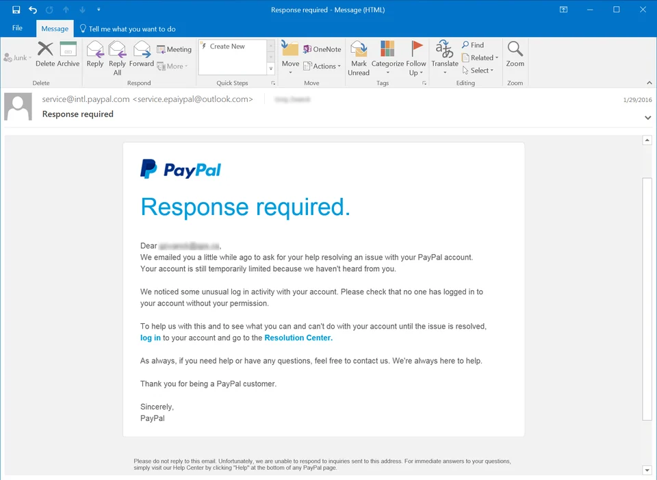

# Phishing Email Analysis Report

## 📧 Sample Email Overview
- **Sender:** service.epayipal@outlook.com
- **Subject:** Response required
- **Claimed Service:** PayPal
- **Screenshot:** 

---

## 🚩 Phishing Indicators Found

### 1. Suspicious Sender
- Domain used: `@outlook.com`
- Legitimate PayPal domains always use `@paypal.com`.

### 2. Urgency and Threats
- Language like “Response required”, “account temporarily limited” used to cause panic.

### 3. Fake Links
- Hyperlinks text is legitimate (“log in”, “Resolution Center”), but they likely lead to malicious sites.

### 4. Impersonal Greeting
- No actual name used in greeting, often a sign of mass phishing.

### 5. No Contact or Signature Verification
- Lacks digital signature, official contact, or validation footer.

---

## 🛠 Tools Used

| Tool | Purpose |
|------|---------|
| MXToolbox | Header analysis |
| VirusTotal | Checking suspicious links |
| Whois Lookup | Verify sender’s domain |
| Browser Hover | Detect mismatched URLs |

---

## ✅ Conclusion
This email is a clear phishing attempt. Indicators include domain spoofing, fear tactics, generic format, and unverified links.

Users must avoid clicking on links and report such emails to the official support of the claimed sender.
